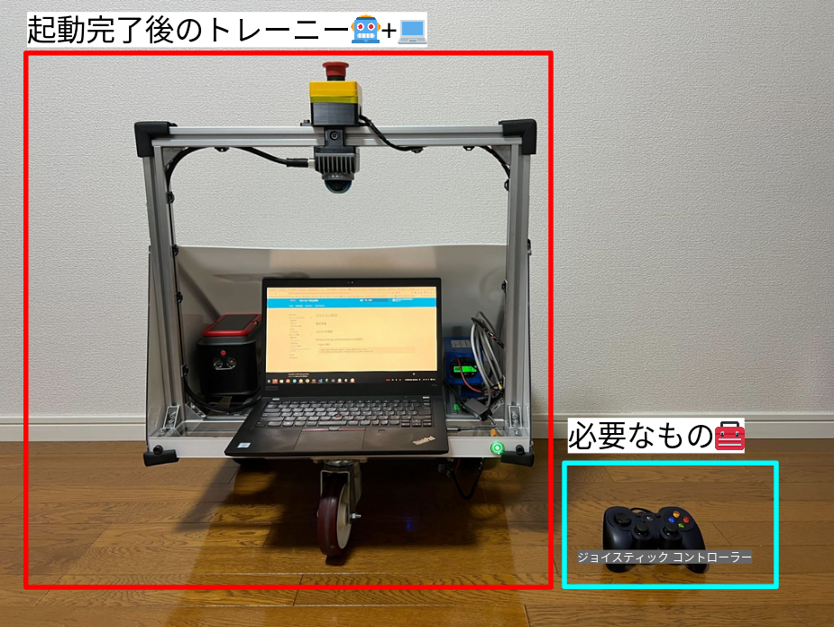
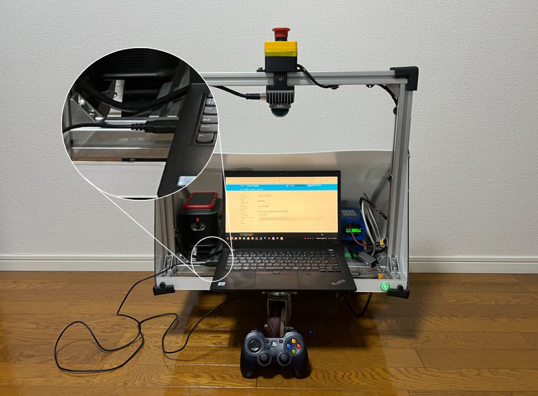
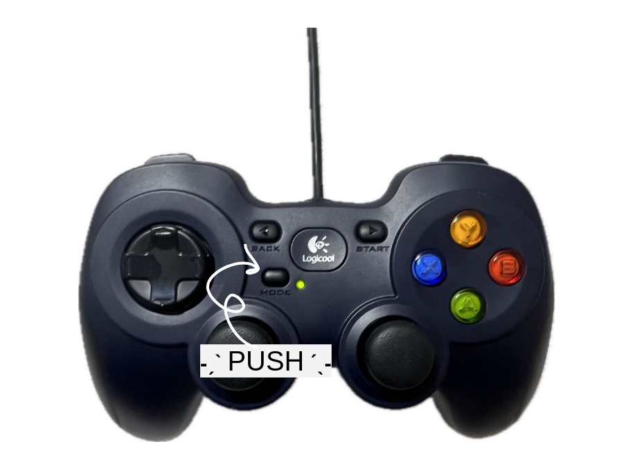
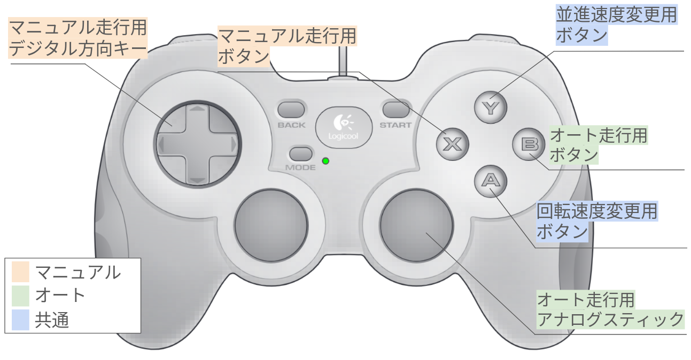
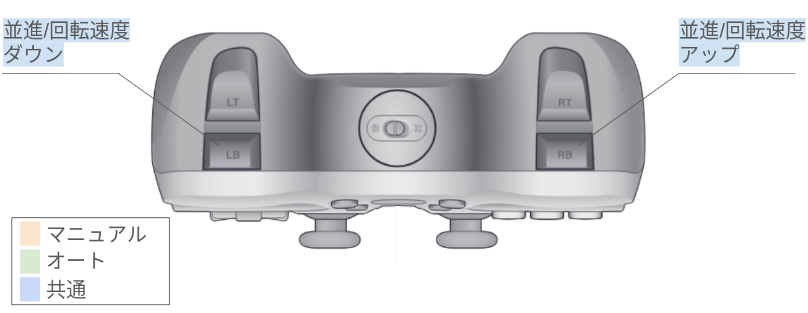

## 事前準備

準備するものは、こちらです！  
全部そろってますか！？
<center><a href="../../../images/trainee_preparation_joycon.png"></a>
</center>

## ジョイスティックコントローラーを接続

ジョイスティックコントローラーをPCに接続しましょう

<center><a href="../../../images/joycon_and_pc_connection.png"></a>
</center>

!!! Warning
    ジョイスティックコントローラーの真ん中のボタンを押して、**緑色に光らせておく**必要があります！（安全のため、そのようにしないと動かないようにしてます）
    <center><a href="../../../images/joycon_push.png"></a>
    </center>

## teleop_twist_joy_comfy.launch.xmlの実行

* `Docker`で実行
```
ros2 launch trainee_launch teleop_twist_joy_comfy.launch.xml
```

## 操作の説明

| 機能                   | 操作手順                                                   | 備考                                   | 
| ---------------------- | ---------------------------------------------------------- | -------------------------------------- | 
| マニュアル走行         | Xボタン＋デジタル方向キー                                  | 操作しにくいです                       | 
| オート走行             | 開始: Bボタン 回転操作: アナログスティック 終了: Bボタン   | 操作しやすいです                       | 
| 並進 / 回転速度 アップ | 並進: Y + RBボタン 回転: A + RBボタン                      | あまり回転速度は上げないほうが良いです | 
| 並進 / 回転速度 ダウン | 並進: Y + LBボタン 回転: A + LBボタン                      | 下げすぎると動きません上げれば動きます | 

<center><a href="../../../images/joycon_explain_foward.png"></a>
</center>

<center><a href="../../../images/joycon_explain_back.png"></a>
</center>