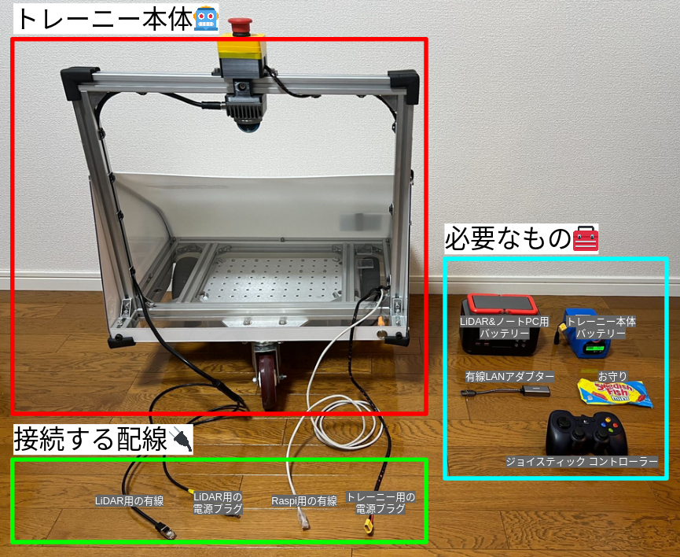
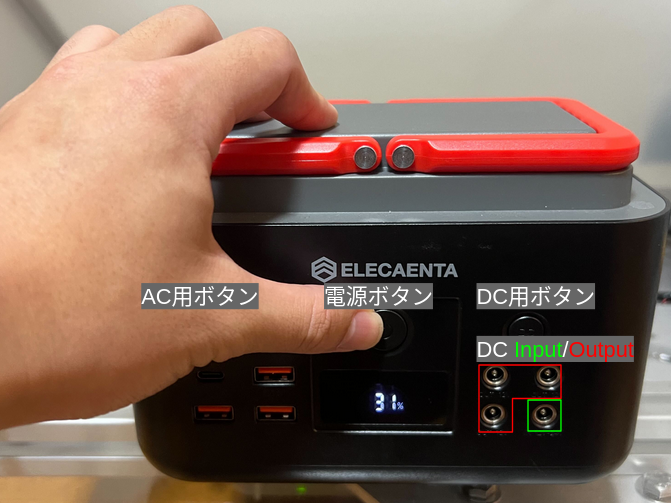
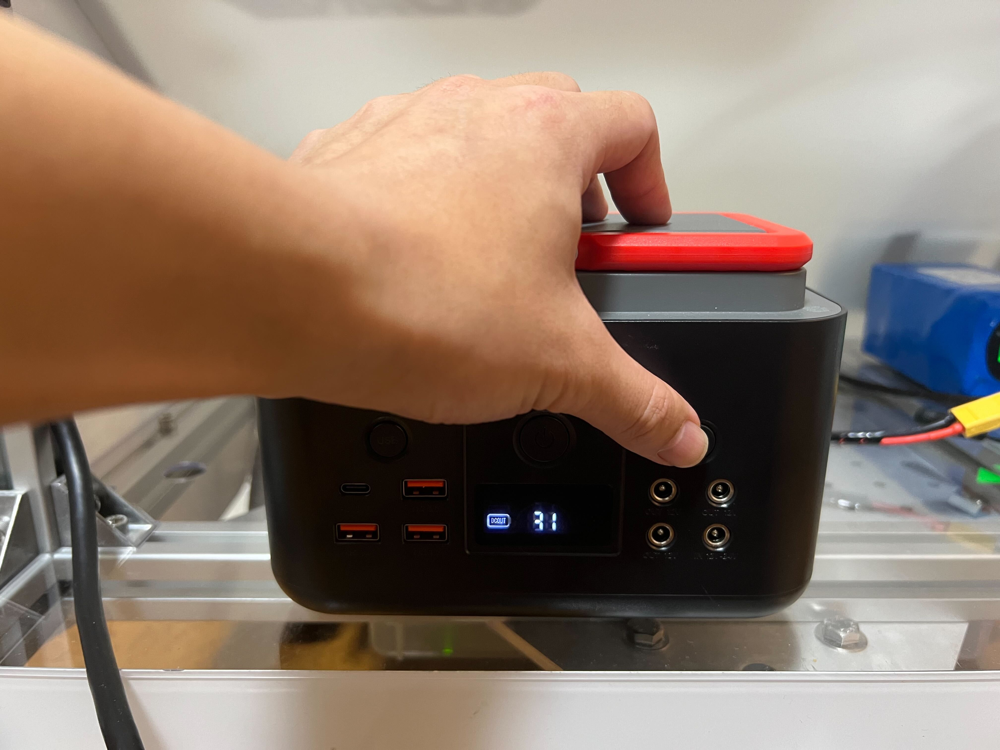
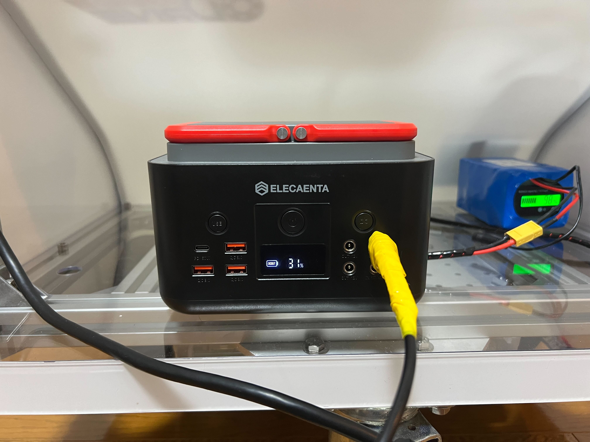
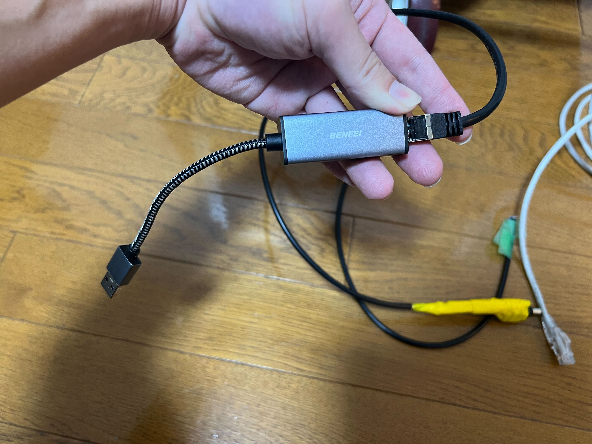
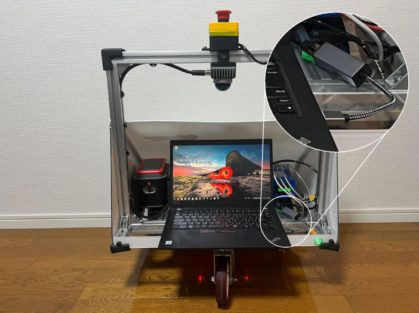
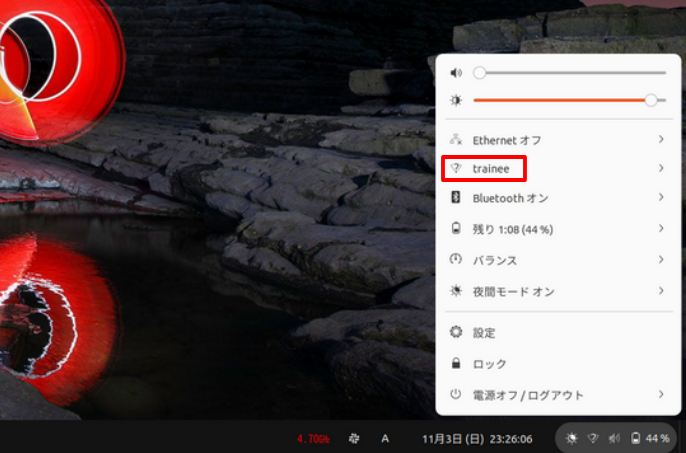
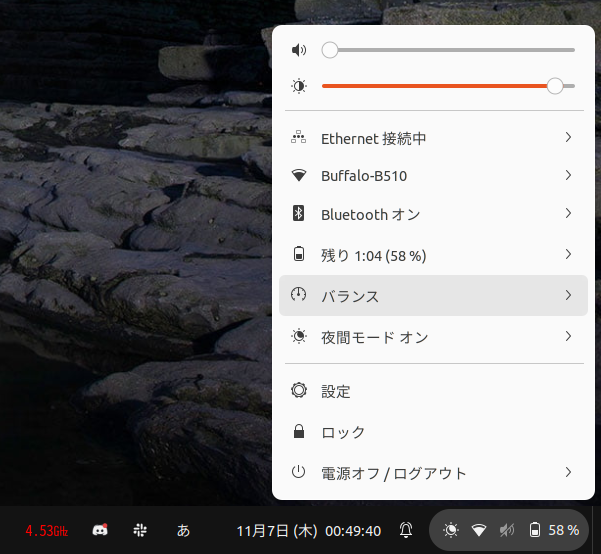

## 事前準備

準備するものは、こちらです！  
全部そろってますか！？
<center><a href="../../../images/trainee_preparation.png"></a>
</center>

## 電源の立ち上げ

### トレーニー本体用バッテリーの接続
`トレーニー用の電源プラグ`と`トレーニー本体用バッテリー`を接続しましょう
<center><a href="../../../images/lithium-ion_battery_connection.png"></a>
</center>

### LiDAR用バッテリーの接続
`LiDAR用の電源アダプタ`と`LiDAR用バッテリー`を接続しましょう

* 電源ボタンを押す（長押し）
<center><a href="../../../images/LiDAR-battery-on.jpg"></a>
</center>

* DC用のボタンを押す（一瞬押すだけ）
<center><a href="../../../images/LiDAR-battery-dc-on.jpg"></a>
</center>

* 接続タイム（一番右下はInput用となっておりますので、気をつけなはれや）
<center><a href="../../../images/LiDAR-battery-dc-connection.jpg"></a>
</center>

### 有線LANアダプターの接続
LiDAR用の有線と有線LANアダプターを接続しましょう
<center><a href="../../../images/wired_LAN_adapter_connection.jpg"></a>
</center>

### お守りを置きましょう？
あれ？`お守り`は、置きましたか？  
まだ置いてないんですね！  
では、`お守り`を優しく置きましょう。
<center><a href="../../../images/set_omamori.gif"></a>
</center>

### 電源ボタン ONするのです
よろしくおねがいしまぁぁぁぁぁぁす！（ポチッ）
<center><a href="../../../images/trainee_power_on.gif"></a>
</center>

## システムの立ち上げ

!!! Info
    コマンドを実行する場所は**計3箇所**あるので、間違えないように気をつけてね！  
    
    * `ノートPC`
    * `Docker（ノートPC上）`
    * `Raspi（ノートPCからのssh越し）`

### ネットワーク接続

* LiDARと接続

LiDARをPCに接続しましょう
<center><a href="../../../images/lidar_and_pc_conection.png"></a>
</center>

* Raspiと接続

Raspiからは`trainee`というホットスポットが立ち上がっているので、接続することでRaspiとノートPCが接続されます

* `ノートPC`で実行
```
nmcli connection show | grep -q '^trainee' && nmcli connection delete trainee; nmcli dev status | awk '$2 == "wifi" {print $1}' | xargs -I{} nmcli con add type wifi ifname {} con-name trainee ssid trainee ipv4.method manual ipv4.addresses 192.168.12.12/24 ipv4.gateway 192.168.12.1 ipv4.dns 8.8.8.8 && nmcli con up trainee
```

<center><a href="../../../images/trainee_wifi_select.png"></a>
</center>

### LiDARのプロファイルの設定    

!!! Info
    **Ethernet 接続中**というステータス状態で実行することを想定しています。  
    接続がタイムアウトしてしまっている場合は、再度LiDARをPCに接続し直しましょう。
    
    <center><a href="../../../images/ethernet_connection_now.png"></a>
    </center>

* `ノートPC`で実行
```
nmcli connection show livox >/dev/null 2>&1 || sudo nmcli connection add type ethernet con-name livox ifname "$(nmcli device status | awk '/ethernet/ && /IP 設定を取得中|configuring/ {print $1}')" ip4 192.168.1.100/24 gw4 192.168.1.1; sudo nmcli connection up livox; sudo nmcli connection reload
```

* LiDARの接続確認

使用しているLiDARのIP: `192.168.1.151`

```
ping 192.168.1.151 #何か定期的に返ってくればおｋ
```

### ssh接続
ノートPCからRaspiにアクセスしましょう

* `ノートPC`で実行
```
ssh ubuntu@192.168.12.1
```

### 時刻同期
Raspiの時刻をPCと同期させます

!!! Info
    一回も実行したことがない場合は、実行しましょう。

    * `ノートPC`で実行（パッケージのインストールにインターネット接続が必要です）
    ```
    bash <(curl -s https://raw.githubusercontent.com/Shinsotsu-Tsukuba-Challenger/trainee_setup_scripts/refs/heads/main/time_synchronization/setup_pc.sh)
    ```

* `Raspi`で実行
```
sudo systemctl restart chrony.service
```

### trainee.launch.pyの実行

traineeの準備はこれでバッチリだぜ👍

* `Raspi`で実行
```
ros2 launch trainee_launch trainee.launch.py
```

### Dockerの立ち上げ


!!! Warning
    Dockerのイメージが最新じゃない場合はpullしましょう！
    
    * `ノートPC`で実行
    ```
    docker pull ghcr.io/shinsotsu-tsukuba-challenger/trainee:humble
    ```
Hey!! Dockerは立ち上がってるかーい？  
Dokcerを立ち上げるぜー！

* `ノートPC`で実行

```
docker run -it \
           -u $(id -u):$(id -g) \
           --privileged \
           --net=host \
           --ipc=host \
           --env="DISPLAY=$DISPLAY" \
           --mount type=bind,source=/dev/input,target=/dev/input \
           --mount type=bind,source=/home/$USER/.ssh,target=/home/runner/.ssh \
           --mount type=bind,source=/home/$USER/.gitconfig,target=/home/$USER/.gitconfig \
           --mount type=bind,source=/usr/share/zoneinfo/Asia/Tokyo,target=/etc/localtime \
           --name trainee \
           ghcr.io/shinsotsu-tsukuba-challenger/trainee:humble
```

### DockerとRaspi間で通信できるようにする

ノートPCの方も準備おっけーだぜ👍

* `Docker`で実行

```
grep -q "export ROS_LOCALHOST_ONLY=" ~/.bashrc && sed -i 's/export ROS_LOCALHOST_ONLY=1/export ROS_LOCALHOST_ONLY=0/' ~/.bashrc || echo "export ROS_LOCALHOST_ONLY=0" >> ~/.bashrc && source ~/.bashrc
```