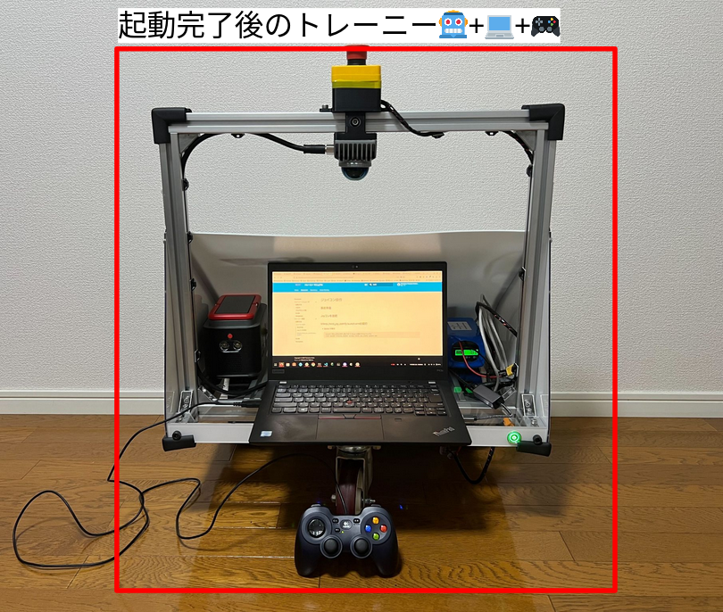

## 事前準備

準備するものは、こちらです！  
全部そろってますか！？
<center><a href="../../../images/trainee_preparation_joycon2.png"></a>
</center>

## LiDARの接続確認

使用しているLiDARのIP: `192.168.1.151`

```
ping 192.168.1.151 #何か定期的に返ってくればおｋ
```

## SLAMを開始する

!!! Warning
    RaspiとノートPCの時刻が合っていることを確認しましょう！
    
    * 合ってなかったら、`Raspi`で実行
    ```
    sudo systemctl restart chrony.service
    ```

* `Raspi`で実行

!!! Warning
    すでに`trainee_launch trainee.launch.py`を立ち上げている場合は、再度立ち上げなおすと良いです。（odomやtfなどを初期化するため）

```
ros2 launch trainee_launch trainee.launch.py
```

* `Docker`で実行

```
ros2 launch trainee_launch teleop_twist_joy_comfy.launch.xml
```

* `Docker`で実行

```
ros2 launch trainee_launch slam.launch.xml
```

## マップをゲット（マックナゲットみたい🤡）

* `Docker`で実行

```
ros2 launch trainee_launch map_save.launch.xml map_name:="map"
```