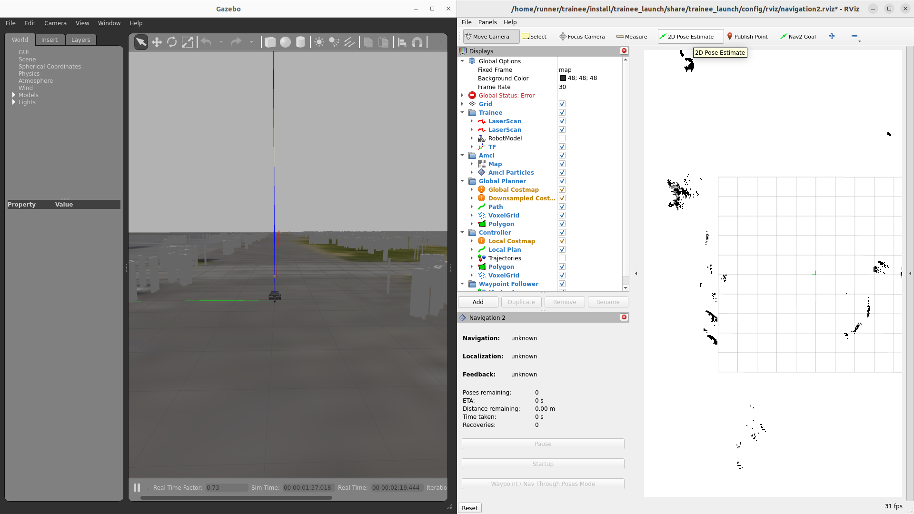
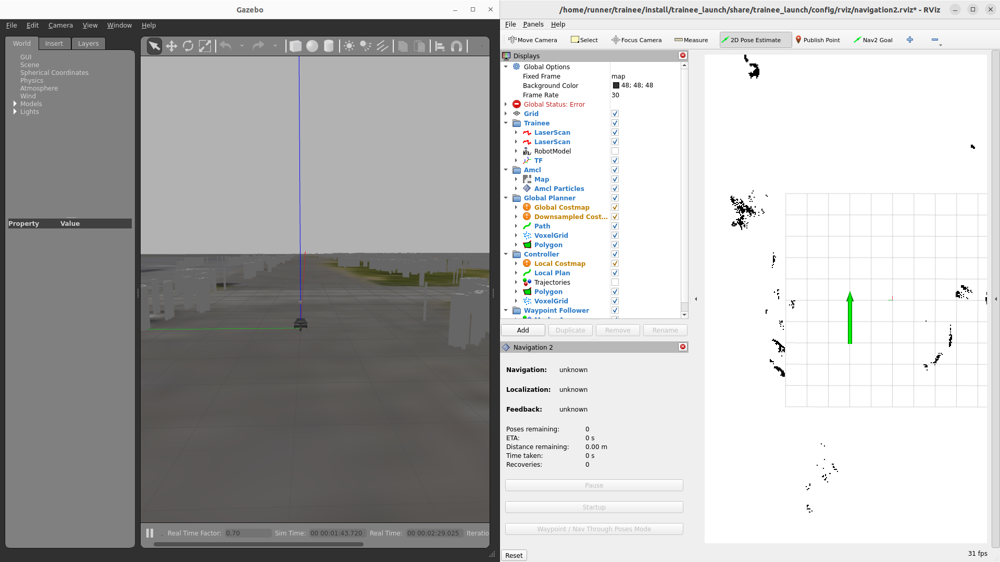
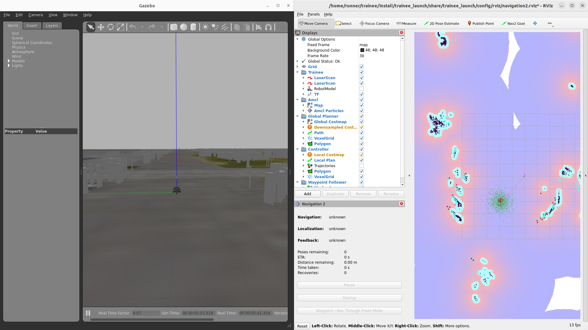
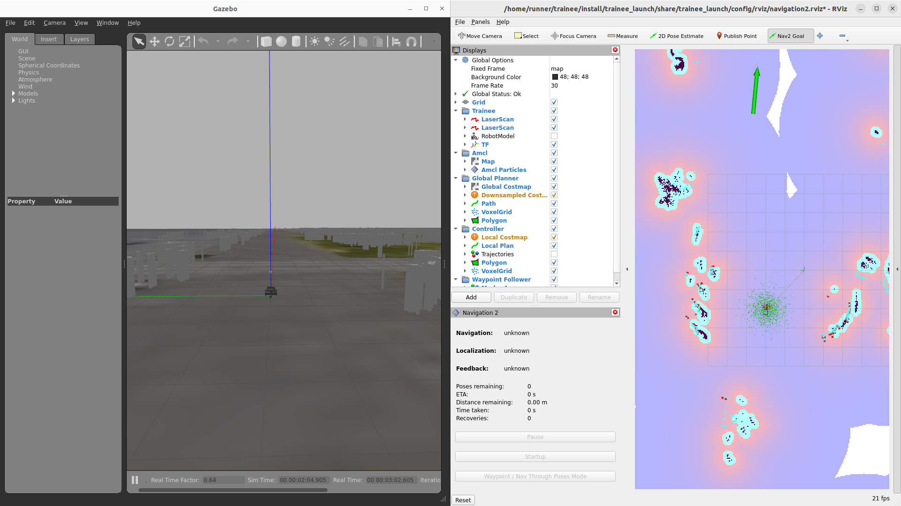
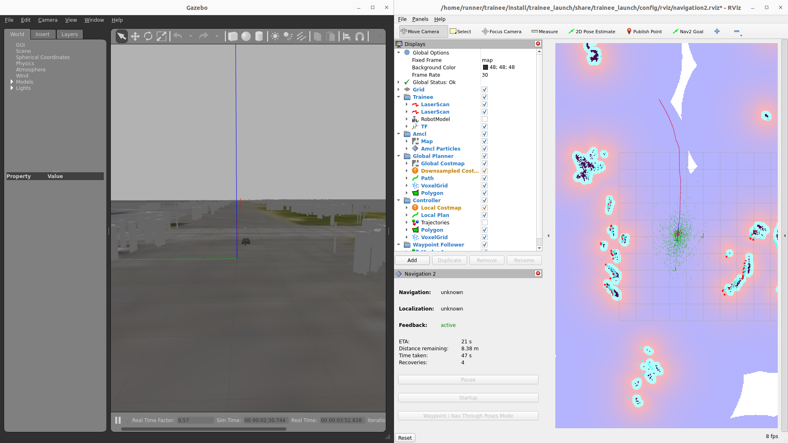

# ROS 2のシミュレータ & トレーニーでNavigationをしよう！

## 概要

トレーニー(実機)を用いてNavigationをする方法説明する。

## Navigationすっぞ

### Navigationに必要なものを起動  
（主にnav2とlivox-mid360のセンサーを起動）
* nav2のparam->config/param/navigation2.param.yaml
* livox-mid360用param->config/param/livox_mid-360.param.yaml
* pointcloud2laserscanのparam->config/param/pointcloud_to_laserscan.param.yaml
```
ros2 launch trainee_launch navigation.launch.xml
ros2 service call /motor_power std_srvs/SetBool '{data: true}'
```

### Navigation実行手順

まずはじめに、地図上のどこにいるのか初期位置を置く必要がある。  
次に目指したい場所にゴールを置くことでNavigationがはじまる。

#### 共通
1. 初期位置を置く `2D Pose Estimate`を使います
<center><a href="../../../images/trainee_navigation_initial_pose.png"></a>
</center>

2. 置きたい位置に置く　長押ししながらマウスを動かすと位置と向きを指定することが可能
<center><a href="../../../images/trainee_navigation_initial_pose_set.png"></a>
</center>

3. 上手く置けるとこんな感じになります Navigationが位置を読み込みます
<center><a href="../../../images/trainee_navigation_initial_pose_set_done.png"></a>
</center>

#### Rviz経由のゴール指定  
1. ゴール位置を置く `Nav2 Goal`を使います
<center><a href="../../../images/trainee_navigation_nav2_goal.png"></a>
</center>

2. 置きたい位置に置く　長押ししながらマウスを動かすと位置と向きを指定することが可能
<center><a href="../../../images/trainee_navigation_nav2_goal_set.png"></a>
</center>

3. 上手く置けるとこんな感じになります Navigationがはじまります
<center><a href="../../../images/trainee_navigation_nav2_goal_set_done.png"></a>
</center>

#### Waypoint経由
Todo